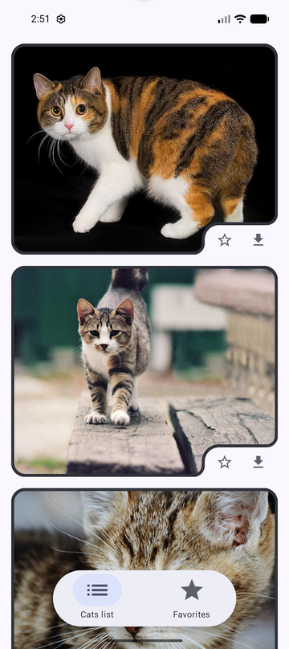
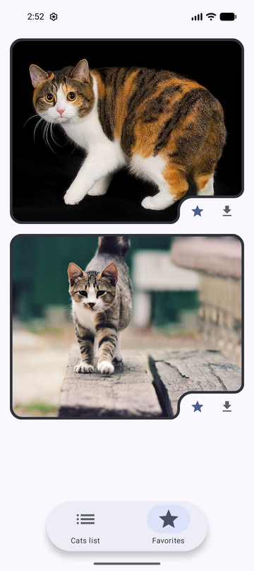
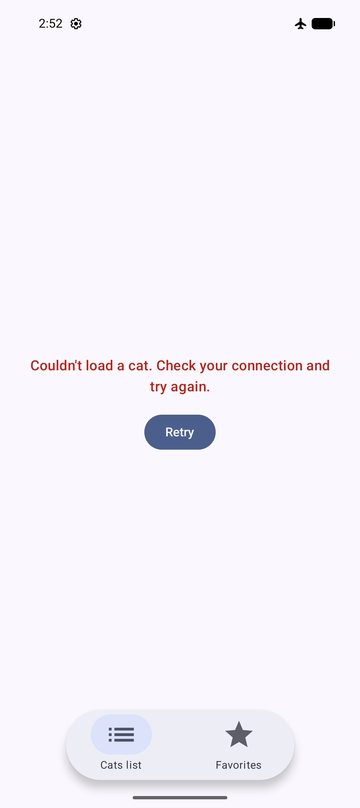

# CatsList


[](https://github.com/romanmahachkala05/CatsListApplication/actions/workflows/ci.yml)

An endless feed of cats from [TheCatAPI](https://developers.thecatapi.com/), with
favorites kept in Room and one-tap image download.

Originally written in 2022 with XML views, `AsyncTask`-era patterns and a
`fallbackToDestructiveMigration()` database. Rebuilt incrementally — Compose,
Clean Architecture, MVI, Navigation 3, Koin, real migrations — one reviewable
pull request at a time, with the build green at every commit.

| Feed | Favorites | Failure and recovery |
| --- | --- | --- |
|  |  |  |

---

## Architecture

Eleven Gradle modules, Clean Architecture, one direction of dependency:

```
:app, :desktopApp  ──►  :shared  ──►  :feature:feed, :feature:favorites  ──►
                  :core:model, :core:domain, :core:data, :core:ui, :core:designsystem
```

Everything below the two entry points is Kotlin Multiplatform, building for
Android and for the JVM (desktop) — the screens included, in Compose
Multiplatform. `:app` and `:desktopApp` are an Activity and a window around the
same `CatsApp()`, which adapts to the window: one column under a bottom bar on a
phone, a grid of two to four beside a navigation rail on anything wider. `:core:model` and `:core:domain` know nothing about
Android at all; `:core:data` implements the repository a use case declares and
splits on three seams — the database path, the HTTP engine, and image download.
It is also the only layer that knows what a `SocketTimeoutException` or an HTTP
429 means: everything crossing out of it is an `AppError`, so no screen branches
on an exception class ([ADR-0032](docs/DECISIONS.md#adr-0032)). Each feature
module exposes exactly two public things, its `NavKey` and one entry
`@Composable`; everything else — ViewModel, StateHolder, ErrorHandler — is
`internal`, enforced by the compiler rather than by convention.

`:feature:favorites` is the same six pieces: an immutable `State` with one
sealed `UiStatus` (never boolean flags), an `Event` type, a `StateHolder` that
is the only thing allowed to mutate state, an `ErrorHandler`, a ViewModel that
merely orchestrates, and a stateless `Content` composable the previews render.
`:feature:feed` is paged (Paging 3 straight from the network, nothing cached —
[ADR-0025](docs/DECISIONS.md#adr-0025)), so loading/error/retry for its list
is `LazyPagingItems.loadState`, collected in the Composable, not this state
machine — Paging already owns that, and reimplementing it would just be
duplicating the library.

This started single-module and split once a second feature and a shared
component were actually about to need it, not ahead of time — see
[ADR-0001](docs/DECISIONS.md#adr-0001) (the original call) and
[ADR-0022](docs/DECISIONS.md#adr-0022) (the split, and why it happened for a
different reason than ADR-0001 predicted).

## Built with

| | |
| --- | --- |
| UI | Jetpack Compose, Material 3, Coil |
| Navigation | Navigation 3 (`NavDisplay`, typed `NavKey`s) |
| DI | Koin |
| Async | Coroutines, Flow |
| Network | Ktor, OkHttp engine — one client, shared with Coil |
| Multiplatform | Kotlin Multiplatform + Compose Multiplatform: Android and desktop; iOS not yet |
| Storage | Room, with real migrations and committed schemas — favorites only |
| Pagination | Paging 3, paging the feed straight from the network |
| Build | Gradle KTS, version catalog, KSP, JDK 17 |
| Tests | JUnit4, Truth, `kotlinx-coroutines-test`, hand-written fakes |

## Tests

**76 unit tests, 37 instrumented.** No mocking library — every test double is a
real in-memory implementation ([ADR-0012](docs/DECISIONS.md#adr-0012)). Tests
live beside the code they test — in the same Gradle module, same package —
rather than in one shared test source set.

The instrumented ones are not optional extras. Three data-loss failures can be
checked nowhere else, because all three are Room behavior that no JVM fake
reproduces: that `@Transaction` really serializes concurrent writes, that
`MIGRATION_2_3` copies every column, and that a v1 database opens instead of
crashing. The rest are Compose UI tests — which branch each screen shows for a
given load state, and what its cards emit when tapped.

Each bug fix in this project was reproduced before being fixed, and every fix
was checked by reverting it to confirm the new test fails — a test that cannot
fail proves nothing.

## Engineering notes

The interesting part of this repo is not the cat list. It is
[`docs/DECISIONS.md`](docs/DECISIONS.md): 36 decision records with the rejected
alternative and the consequences, including four superseded by a later one and
one amended by two. A sample:

- **[ADR-0014](docs/DECISIONS.md#adr-0014)** — a double tap on the favorite
  button crashed the app. `OnConflictStrategy.REPLACE` would have stopped the
  crash while leaving the race; a `@Transaction` removed it.
- **[ADR-0015](docs/DECISIONS.md#adr-0015)** — two overlapping page loads each
  filtered against a stale snapshot and appended the same cats, crashing
  `LazyColumn` on a duplicate key. Reproduced as `[1, 2, 1, 2]`.
- **[ADR-0013](docs/DECISIONS.md#adr-0013)** — `runCatching` swallows
  `CancellationException`, so leaving a screen mid-request was reported to the
  user as a failure.
- **[ADR-0017](docs/DECISIONS.md#adr-0017)** — replacing a blanket destructive
  fallback with real migrations turned a silent data wipe into a launch crash
  for v1 databases.
- **[ADR-0016 → ADR-0019](docs/DECISIONS.md#adr-0016)** — a decision that was
  right for the design it was made in, and was superseded once the design
  changed.
- **[ADR-0001 → ADR-0022](docs/DECISIONS.md#adr-0001)** — single-module was a
  decision with a stated trigger for splitting; the split happened for a
  related but different reason than the one that was written down.
- **[ADR-0032](docs/DECISIONS.md#adr-0032)** — every failure showed one
  message, so a rate-limited feed told the user to check a connection that was
  working. Telling "offline" from "server unreachable" turns out to need a
  connectivity stream ([ADR-0031](docs/DECISIONS.md#adr-0031)) consulted at the
  moment of failure, not a boolean checked before the request.
- **[ADR-0033](docs/DECISIONS.md#adr-0033)** — the Compose compiler's own
  stability report, not a guess: `Cat` was unstable because `:core:model` has no
  Compose compiler, so every card in the feed compared by identity against a
  freshly copied instance and none of them could skip.
- **[ADR-0018 → ADR-0035](docs/DECISIONS.md#adr-0035)** — a documented gate that
  was never actually configured, and a tier split that quietly assumed
  compiling a test needed the same device as running it.

Several of those were introduced during this rebuild, not inherited. They are
recorded because finding them was the work.

## Build and run

```bash
git clone https://github.com/romanmahachkala05/CatsListApplication.git
cd CatsListApplication
./gradlew installDebug        # Android
./gradlew :desktopApp:run     # desktop
```

JDK 17. No API key required — TheCatAPI's search endpoint is open.

```bash
./gradlew verify           # assemble, every unit test, and compile the instrumented ones. No device needed.
./gradlew verifyOnDevice   # the above + running the instrumented tests. Needs a device.
```

`verify` builds each module's instrumented test APK even though it cannot run
it, because compiling those tests needs no device and not compiling them let
three of them break unnoticed ([ADR-0035](docs/DECISIONS.md#adr-0035)).

`verify` runs on every pull request — whatever branch it targets
([ADR-0034](docs/DECISIONS.md#adr-0034)) — and is a required check on `dev`.

## Documentation

- [**Contributing**](CONTRIBUTING.md) — commands, conventions, commit and branch rules
- [**Architecture**](docs/ARCHITECTURE.md) — the rules the code follows
- [**Decisions**](docs/DECISIONS.md) — why those rules, and what was rejected
- [**Releasing**](RELEASING.md) — signing setup and how a release is cut

## Known gaps

Tracked honestly rather than hidden: the instrumented tests do not yet run in
CI, which is why `verifyOnDevice` is a local step before a release
([ADR-0018](docs/DECISIONS.md#adr-0018)). `verify` now at least compiles them
([ADR-0035](docs/DECISIONS.md#adr-0035)), so what a device is still needed for
is an assertion that compiles and is wrong.

Multiplatform-specific: iOS is not a declared target yet ([ADR-0029](docs/DECISIONS.md#adr-0029)),
and `ErrorMapper` still catches `java.net`/`java.io`
types directly in `commonMain` — fine for the `jvm()`+`androidTarget()` this
module targets today, not fine once a non-JVM target is real
([ADR-0030](docs/DECISIONS.md#adr-0030)).
